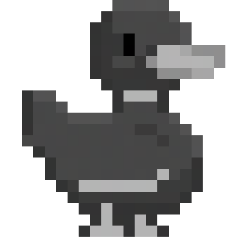
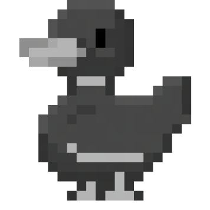

  

  

  
  
  
<!--   &locale=pt_BR -->

----
[ PT-BR ]

**🔗` Desenvolvedor Web FullStack`** **`✨ Designer UX e UI`** **`🏆 Campeão Mundial de Robótica FLL`** **`🎖️ Campeão Brasileiro de Robótica FTC`**

Olá Mundo! Sou um entusiasta de tecnologia apaixonado por desenvolvimento web e robótica, sempre buscando ampliar meus horizontes e contribuir para a comunidade de desenvolvedores. Como Desenvolvedor Front-end, minha jornada é impulsionada pela criação de experiências excepcionais para os usuários. Trabalho principalmente com tecnologias como React, Flutter, Next.JS, Gatsby e Vite, explorando cada uma delas para criar interfaces responsivas e dinâmicas.

Orgulhoso fundador da comunidade Developers Hub! O Developers Hub é mais do que apenas um espaço, é um lar para desenvolvedores aspirantes e experientes se conectarem, compartilharem conhecimentos e encontrarem suporte mútuo em suas jornadas profissionais. Sinta-se à vontade para se juntar a esta comunidade acolhedora e colaborativa! Se você está procurando uma boa fonte de conhecimento, confira minha comunidade no Discord "[DevelopersHub](https://discord.gg/3vAZuNnM)"

----
[ EN ]

**`🔗 FullStack Web Developer`** **`✨ UX and UI Designer`** **`🏆 FLL Robotics World Champion`** **`🎖️ FTC Robotics Brasilian Champion`**

Hello World! I'm a technology enthusiast passionate about web development and robotics, constantly seeking to broaden my horizons and contribute to the developer community. As a Front-end Developer, my journey is driven by creating exceptional user experiences. I primarily work with technologies like React, Flutter, Next.JS, Gatsby, and Vite, exploring each of them to craft responsive and dynamic interfaces.

Pround founder of the Developers Hub community! The Developers Hub is more than just a space, it's a home for aspiring and experienced developers to connect, share knowledge, and find mutual support in their professional journeys. Feel free to join this welcoming and collaborative community! So if you are looking for a good source of knowlege, check out my discord community "[DevelopersHub](https://discord.gg/3vAZuNnM)"
 

----

<h3 align="center"> LeetCode & CodeWars </h3>

  

  

----

  <h3 align="center"> Status do meu Perfil do GitHub - GitHub Profile Stats </h3>

  <!-- https://github.com/anuraghazra/github-readme-stats -->
  

    
  

  

    
  

  <!--  -->

----

  <!-- https://github.com/ashutosh00710/github-readme-activity-graph -->

<h3 align="center">Minhas Ferramentas Favoritas • My Favorite Tools</h3>

  <!-- Linguagens -->
  <h4>Linguagens de Programação e Marcação</h4>
  

    
    
    
    
    
    
    
    
  

  <!-- Frameworks -->
  <h4>Frameworks e Bibliotecas</h4>
  

    
    
    
    
    
    
  

  <!-- ORMs e Mensageria -->
  <h4>ORMs & Mensageria</h4>
  

    
    
    
  

  <!-- Bancos de Dados -->
  <h4>Bancos de Dados</h4>
  

    
    
    
  

  <!-- Ferramentas Complementares -->
  <h4>Ferramentas Complementares</h4>
  

    
    
    
    
    
    
  

